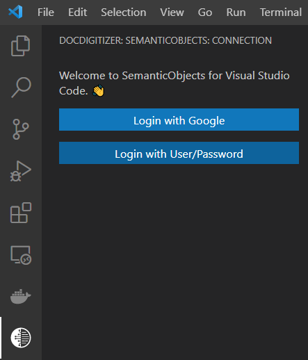
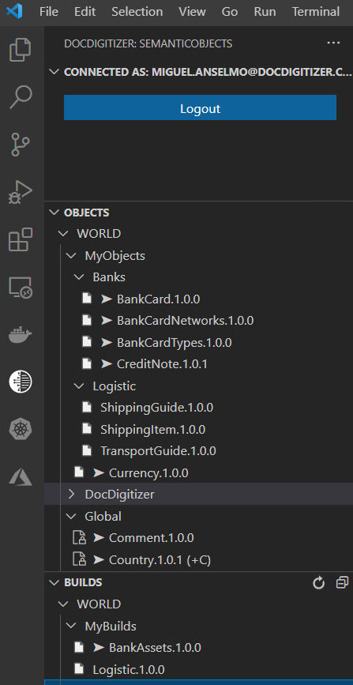

# Things you should know

## What is WorldObjects?
At [DocDigitizer](https://www.docdigitizer.com/) we aim to unburden people from robotic work, including developers.

**DocDigitizer WorldObjects** is a development platform that allows developers to leverage or build a myriad of human semantic objects. With **WorldObjects** you actually create native .Net code, leveraging the power of the .Net framework. WorldObjects also may be bundled with data. It means for developers thousands of hours saved both in structuring common objects like countries, languages or custom objects like ISIN objects, but also managing the data load of those objects.

With **WorldObjects** you can endless navigate in strong type mode during code development.

Example:

&nbsp;&nbsp;&nbsp;&nbsp;***var customerIntlDialCode = document.Invoice.Customer.Address.ZipCode.Country.IntlDialCode;***

In this example, we have a document (like an invoice) that has a customer address. Although international phone dial code is not mentioned in the document, it can seamlessly be retrieved by the framework through underlying Catalogs (ZipCode and Country for this case). Imagine how many tables, sql queries and alike you'd need to run this simple line of code in your current projects.

WorldObjects eliminates the need for developers to reinvent the wheel every time they create an application. With WorldObjects the common human concepts like countries, addresses, document types or id cards are already available. DocDigitizer WorldObjects represents Entity Objects such as a Customer, an Invoice or a Citizen Card, in a semantic way. You can use global WorldObjects from the global repository or create your own objects. Read the technical documentation in [WorldObjects developers portal](https://developers.docdigitizer.com/v2.0/docs/docdigitizer-worldobjects-reference-guide) .

Using WorldObjects, you can bundle applications that reflect a specific scenario. They allow you to refer to objects in a standardized way, abstracting from concrete implementations of these Objects.
## WorldObjects in DocDigitizer
**DocDigitizer** offers a framework and a scalable platform, **DocDigitizer WorldObjects**, where you can create your Entities using the semantic language provided by the framework, and access/manage them, using the available tools from the platform.

**DocDigitizer WorldObjects** provides semantic language to help create and define your Business Objects, adding properties that define each object and index mechanisms which can be helpful to support semantic query processing.

You can also use predefined semantic objects shipped with **DocDigitizer WorldObjects**.

## Catalogs in DocDigitizer WorldObjects
 **DocDigitizer WorldObjects** you can choose what information you want to work with, then let the system retrieve the data from the appropriate systems without you knowing what the source systems are.

**DocDigitizer WorldObjects** provide functionalities where you can associate the "data domain" related to each object, this is, associate list of values like "list of countries", which we refer as Catalogs 

This Catalogs can be "managed":
* **Local Catalogs** managed "client-side", where the data can be stored “in code". 
* **Remote Catalogs** managed "server-side", where the data can be store in Database or can be obtained invoking Services/API.

You can also use Catalogs (and their related semantic objects) shipped with **DocDigitizer WorldObjects**.

For more information, please consult our website where you can find guidelines, tutorials, among other information that can help you get started.
[Guidelines](https://developers.docdigitizer.com/v2.0/docs/getting-started-with-docdigitizer-worldobjects)

# Pre-requiremets

The following software should be installed on &quot;client-side&quot;:

| **Name** | **Company** | **Version** |
| --- | --- | --- |
| [.NET Core](https://dotnet.microsoft.com/download/dotnet/5.0) | Microsoft | 5 |
| [Visual Studio Code](https://code.visualstudio.com/download) | Microsoft | 1.61+ |

# Setup

## Login
Login using a Google account or Custom:

If login successfully, source folders should appear:

# DocDigitizer
For more information about DocDigitizer and other produts and services provided, please consult our website:  
&nbsp;&nbsp;&nbsp;&nbsp;[DocDigitizer](https://www.docdigitizer.com/)  
&nbsp;&nbsp;&nbsp;&nbsp;[DocDigitizer - WorldObjects](https://worldobjects.docdigitizer.com)  
&nbsp;&nbsp;&nbsp;&nbsp;[DocDigitizer - Developers Portal](https://developers.docdigitizer.com)
